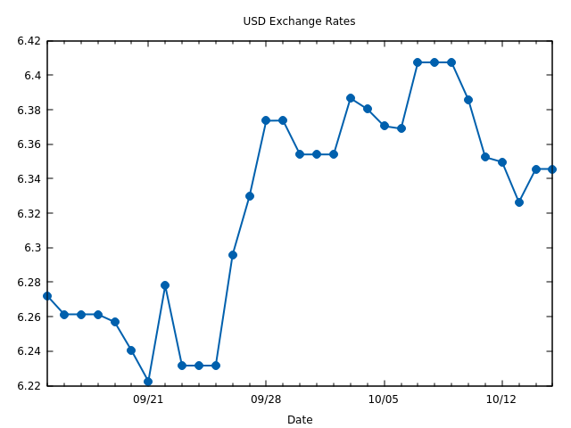

HNB Exchange Rate CLI
=====================

Displays exchange rates for Croatian Kuna (HRK) from the Croatian National Bank
(HNB). Data is fetched from http://hnbex.eu/. Thanks to `Good Code
<http://goodcode.io/>`_ for providing this service.

.. image:: https://img.shields.io/badge/author-%40ihabunek-blue.svg?maxAge=3600&style=flat-square
   :target: https://mastodon.social/@ihabunek
.. image:: https://img.shields.io/github/license/ihabunek/hnbex-cli.svg?maxAge=3600&style=flat-square
   :target: https://opensource.org/licenses/GPL-3.0
.. image:: https://img.shields.io/pypi/v/hnbex-cli.svg?maxAge=3600&style=flat-square
   :target: https://pypi.python.org/pypi/hnbex-cli

Installation
------------

Requires **Python 3.3** or greater.

Drawing charts requires `gnuplot <http://www.gnuplot.info/>`_.

Install from the Python Package Index:

.. code-block::

    pip install hnbex-cli

Usage
-----

Commands:

* ``daily``   - Show daily exchange rates for all currencies
* ``range``   - Show exchange rates for a single currency in the given date range
* ``chart``   - Draw exchange rate chart for a single currency
* ``convert`` - Convert between currencies

Daily
~~~~~

Show rates for all currencies on a given date (if not given, date defaults to today):

.. code-block::

    $ hnbex daily 2017-07-03

.. code-block::

    HNB exchange rates on 2017-07-03

    Currency  Unit    Buying    Median   Selling
    --------  ----  --------  --------  --------
    AUD          1  4.974959  4.989929  5.004899
    CAD          1  4.984697  4.999696  5.014695
    CZK          1  0.281550  0.282397  0.283244
    DKK          1  0.993132  0.996120  0.999108
    HUF        100  2.390306  2.397498  2.404690
    JPY        100  5.783341  5.800743  5.818145
    NOK          1  0.772153  0.774476  0.776799
    SEK          1  0.764812  0.767113  0.769414
    CHF          1  6.756313  6.776643  6.796973
    GBP          1  8.410575  8.435883  8.461191
    USD          1  6.474949  6.494432  6.513915
    EUR          1  7.385326  7.407549  7.429772
    PLN          1  1.748834  1.754096  1.759358

Range
~~~~~

Show rates for a single currency, for range of days.

The range defaults to the last 30 days, and can be changed by giving one or more of:

* ``--start`` or ``-s`` - the first day of the range (default calculated as ``end - days``)
* ``--end`` or ``-e`` - the last day of the range (defaults to tomorrow)
* ``--days`` or ``-d`` - number of days in the range (defaults to 30)

.. code-block::

    $ hnbex range usd -d 10

.. code-block::

    HNB exchange rates for USD from 2021-08-26 to 2021-09-04

          Date  Unit    Buying    Median   Selling    Diff
    ----------  ----  --------  --------  --------  ------
    2021-08-26     1  6.353770  6.372889  6.392008
    2021-08-27     1  6.341215  6.360296  6.379377  -0.20%
    2021-08-28     1  6.346328  6.365424  6.384520  +0.08%
    2021-08-29     1  6.346328  6.365424  6.384520   0.00%
    2021-08-30     1  6.346328  6.365424  6.384520   0.00%
    2021-08-31     1  6.323093  6.342119  6.361145  -0.37%
    2021-09-01     1  6.314960  6.333962  6.352964  -0.13%
    2021-09-02     1  6.315040  6.334042  6.353044  +0.00%
    2021-09-03     1  6.294947  6.313889  6.332831  -0.32%
    2021-09-04     1  6.291559  6.310490  6.329421  -0.05%

Chart
~~~~~

This command requires `gnuplot <http://www.gnuplot.info/>`_ to be installed.

Draw a chart of exchange rate movement for range of days. Options are identical as ``hnbex range``.

.. code-block::

    $ hnbex chart usd

.. code-block::

                                  USD Exchange Rates

    6.42 +-+--+-+-+-+--+-+-+-+--+-+-+-+--+-+-+--+-+-+-+--+-+-+-+--+-+-+-+--+-+
         |             +              +               +    x*x*x**    +      |
     6.4 +-+                                              *                +-+
    6.38 +-+                                      x*x*    *       x        +-+
         |                            x**x       *    x**x         *         |
    6.36 +-+                          *   *      *                 *       +-+
         |                           *     x*x**x                   x*x    x*x
    6.34 +-+                         *                                 * **+-+
         |                          x                                   x    |
    6.32 +-+                       *                                       +-+
     6.3 +-+                       *                                       +-+
         |                        x                                          |
    6.28 +-+             x        *                                        +-+
         x*x**x*x*       **      *                                           |
    6.26 +-+      x*    * *      *                                         +-+
    6.24 +-+        x** *  *    *                                          +-+
         |             *   x*x**x     +               +               +      |
    6.22 +-+--+-+-+-+--x-+-+-+--+-+-+-+--+-+-+--+-+-+-+--+-+-+-+--+-+-+-+--+-+
                     09/21          09/28           10/05           10/12
                                         Date

Also supports graphical charts:

.. code-block::

    $ hnbex chart usd --template qt

Which displays the chart:

Convert
~~~~~~~

Convert between HRK and anouther currency:

.. code-block::

    $ hnbex convert 150 hrk usd

.. code-block::

    150.0 HRK = 23.82 USD

    Using the median rate 1 USD = 6.296589 HRK defined on 2017-08-21

When converting to HRK, the target currency can be ommited:

.. code-block::

    $ hnbex convert 500 jpy

.. code-block::

    500.0 JPY = 28.85 HRK

    Using the median rate 100 JPY = 5.769743 HRK defined on 2017-08-21

If ``--value-only`` or ``-v`` option is used, only the resulting value will be output.

.. code-block::

    $ hnbex convert 500 jpy

.. code-block::

    28.85

The resulting value is rounded to 2 decimal places by default but can be changed by using the ``-p`` or ``--precision`` option:

.. code-block::

    $ hnbex convert 500 jpy -p 10

.. code-block::

    28.8487150000

License
-------

Copyright © 2017-2021 Ivan Habunek <ivan@habunek.com>

Licensed under the GPLv3: http://www.gnu.org/licenses/gpl-3.0.html
